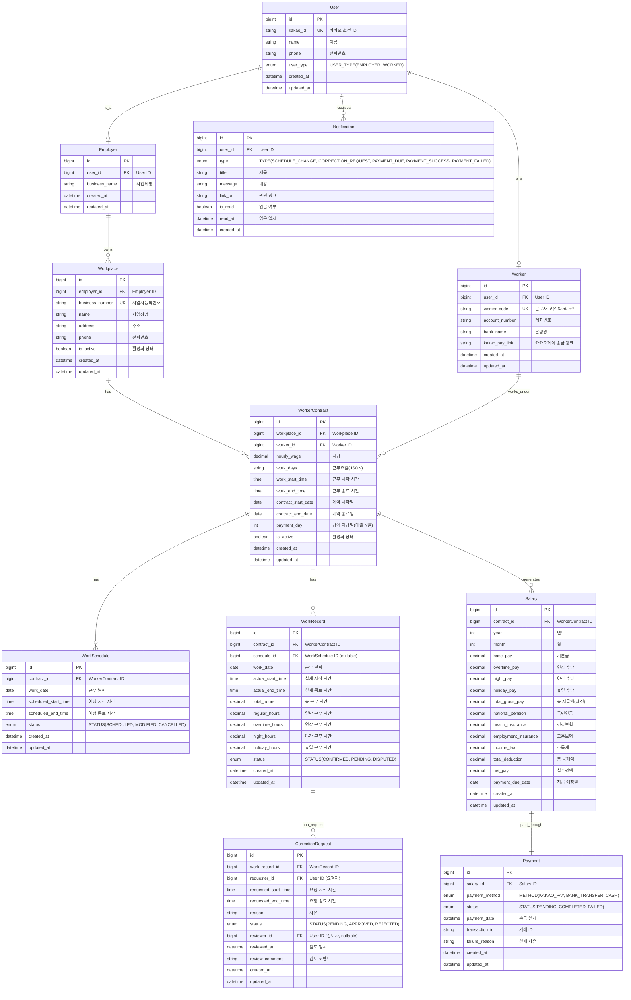

# WageManager ERD (Entity Relationship Diagram)

## 엔티티 관계도

## 엔티티 설명

### 1. User (사용자)
- 고용주와 근로자의 공통 사용자 정보
- 카카오 소셜 로그인 연동
- user_type으로 역할 구분

### 2. Employer (고용주)
- User를 상속받는 고용주 전용 정보
- 사업체 관련 정보 관리

### 3. Worker (근로자)
- User를 상속받는 근로자 전용 정보
- 6자리 고유 식별코드 자동 생성
- 급여 수령을 위한 계좌/카카오페이 정보

### 4. Workplace (사업장)
- 고용주가 운영하는 사업장 정보
- 사업자등록번호로 유효성 검증

### 5. WorkerContract (근로 계약)
- 사업장과 근로자 간의 근로 계약
- 시급, 근무 시간, 지급일 등 계약 조건

### 6. WorkSchedule (근무 일정)
- 예정된 근무 스케줄
- 계약 기반으로 자동 생성 또는 수동 등록

### 7. WorkRecord (근무 기록)
- 실제 출퇴근 기록
- 일반/연장/야간/휴일 근무 시간 자동 계산

### 8. CorrectionRequest (정정 요청)
- 근로자가 근무 기록 수정을 요청
- 고용주가 승인/반려 처리

### 9. Salary (급여)
- 월별 급여 정산 내역
- 기본급, 각종 수당, 4대 보험 및 세금 공제 포함

### 10. Payment (송금)
- 급여 송금 내역 및 상태 관리
- 카카오페이, 계좌이체 등 다양한 방식 지원

### 11. Notification (알림)
- 사용자별 알림 내역
- 일정 변경, 정정 요청, 송금 등 다양한 이벤트

## 주요 관계

1. **User ↔ Employer/Worker**: 상속 관계 (Single Table or Joined)
2. **Employer → Workplace**: 1:N (한 고용주가 여러 사업장 운영)
3. **Workplace ↔ Worker → WorkerContract**: N:M (다대다 관계를 계약으로 해소)
4. **WorkerContract → WorkSchedule/WorkRecord/Salary**: 1:N
5. **WorkRecord → CorrectionRequest**: 1:N
6. **Salary ↔ Payment**: 1:1

## 인덱스 전략

- User: kakao_id (UK), user_type
- Worker: worker_code (UK)
- Workplace: business_number (UK), employer_id
- WorkerContract: workplace_id, worker_id, is_active
- WorkSchedule: contract_id, work_date
- WorkRecord: contract_id, work_date, status
- Salary: contract_id, year, month
- Payment: salary_id, status
- Notification: user_id, is_read, created_at

## 보안 고려사항

- 급여 데이터: AES-256 암호화
- 계좌번호: 암호화 저장
- 통신: HTTPS (TLS 1.3)
- 접근 제어: 고용주는 자신의 사업장 데이터만, 근로자는 자신의 근무 기록만 접근
