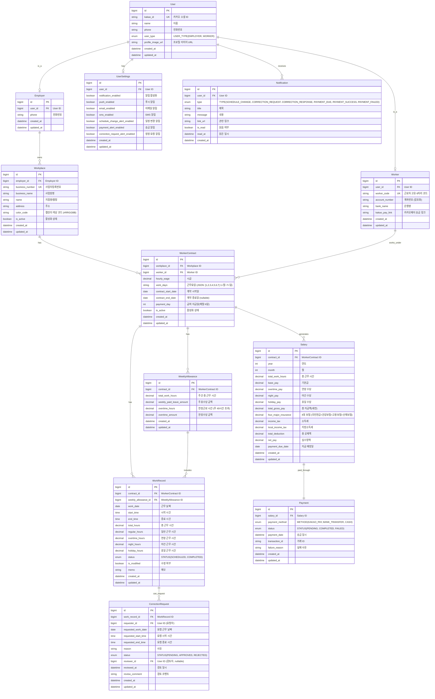

# WageManager ERD (Entity Relationship Diagram)

## 엔티티 관계도

## 엔티티 설명

### 1. User (사용자)
- 고용주와 근로자의 공통 사용자 정보
- 카카오 소셜 로그인 연동
- user_type으로 역할 구분 (EMPLOYER, WORKER)
- 프로필 이미지 URL 추가

### 2. Employer (고용주)
- User를 상속받는 고용주 전용 정보
- **phone**: 고용주 연락처 (모든 사업장에 공통 사용)

### 3. Worker (근로자)
- User를 상속받는 근로자 전용 정보
- 6자리 고유 식별코드 자동 생성
- 급여 수령을 위한 계좌/카카오페이 정보
- 계좌번호는 AES-256 암호화 저장

### 4. Workplace (사업장)
- 고용주가 운영하는 사업장 정보
- 사업자등록번호로 유효성 검증
- **business_name**: 사업장명 (법인명 등)
- **name**: 지점명 또는 별칭 (예: "홍대점", "강남점")
- **color_code**: 캘린더에서 근무지별 색상 구분을 위한 필드
- 한 고용주가 여러 사업장을 운영할 수 있음

### 5. WorkerContract (근로 계약)
- 사업장과 근로자 간의 근로 계약
- 시급, 근무요일, 지급일 등 계약 조건
- **work_days**: JSON 배열로 저장 (예: [1,2,3,4,5] = 월~금, 1=월요일~7=일요일)

### 6. WorkRecord (근무 기록 및 일정)
- **WorkSchedule 통합**: 예정된 근무 일정과 실제 근무 기록을 하나의 엔티티로 관리
- **start_time/end_time**: 근무 시간 (등록 시 예정 시간, 수정 시 실제 시간으로 업데이트)
- **total_hours**: 총 근무 시간 (start_time ~ end_time 기준으로 자동 계산)
- 일반/연장/야간/휴일 근무 시간 자동 계산
- **STATUS**:
  - SCHEDULED: 예정 (근무 전)
  - COMPLETED: 완료 (근무 후)
- **is_modified**: 수정 여부 (근무 전/후 상관없이 시간 변경 시 true)
- **weekly_allowance_id**: 주간 수당 집계를 위한 WeeklyAllowance 참조

### 7. WeeklyAllowance (주간 수당)
- 주 단위로 근무 기록을 집계하여 주휴수당 및 연장수당 계산
- **total_work_hours**: 주간 총 근무 시간 (WorkRecord 합산)
- **weekly_paid_leave_amount**: 주휴수당 금액
  - 주 15시간 이상 근무 시 지급
  - 계산식: (1주 소정근로 시간 / 40) × 8 × 시급
- **overtime_hours**: 연장근로 시간 (주 40시간 초과 시)
- **overtime_amount**: 연장수당 금액
  - 계산식: 초과 시간 × 기본시급 × 1.5배율
- WorkRecord와 1:N 관계로 해당 주의 모든 근무 기록을 참조

### 8. CorrectionRequest (정정 요청)
- 근로자가 근무 기록 수정을 요청
- 고용주가 승인/반려 처리
- **requested_work_date**: 수정 요청 날짜 추가
- 화면에서 보이는 "시작 시간", "종료 시간", "사유" 필드 포함

### 9. Salary (급여)
- 월별 급여 정산 내역
- 기본급, 각종 수당, 4대 보험 및 세금 공제 포함
- **total_work_hours**: 총 근무 시간
- **four_major_insurance**: 4대 보험 통합 (국민연금+건강보험+고용보험+산재보험)
- **local_income_tax**: 지방소득세
- **급여 공제 계산**: `DeductionCalculator` 클래스를 통해 자동 계산
  - `PayrollDeductionType` enum으로 4가지 급여 공제 유형 지원
  - 4대 보험 및 세금 자동 계산

### 10. Payment (송금)
- 급여 송금 내역 및 상태 관리
- 카카오페이, 계좌이체 등 다양한 방식 지원
- **상태**: PENDING(대기), COMPLETED(완료), FAILED(실패)
- **자동 실패 처리**: 매일 자정 스케줄러(`PaymentAutoFailScheduler`)가 실행되어 지급 예정일(payment_due_date)이 경과한 PENDING 상태의 결제를 자동으로 FAILED 처리

### 11. Notification (알림)
- 사용자별 알림 내역
- **CORRECTION_RESPONSE**: 정정 요청 응답 알림 타입 추가
- 일정 변경, 정정 요청, 송금 등 다양한 이벤트

### 12. UserSettings (사용자 설정)
- 사용자별 알림 설정 관리
- 푸시, 이메일, SMS 알림 개별 설정
- 알림 유형별 활성화/비활성화 설정

## 주요 관계

1. **User ↔ Employer/Worker**: 상속 관계 (Single Table or Joined)
2. **User → UserSettings**: 1:1 (사용자 설정)
3. **Employer → Workplace**: 1:N (한 고용주가 여러 사업장 운영)
4. **Workplace ↔ Worker → WorkerContract**: N:M (다대다 관계를 계약으로 해소)
5. **WorkerContract → WorkRecord/Salary/WeeklyAllowance**: 1:N
6. **WeeklyAllowance → WorkRecord**: 1:N (주 단위 근무 기록 집계)
7. **WorkRecord → CorrectionRequest**: 1:N
8. **Salary ↔ Payment**: 1:1

## 화면 설계 반영 사항

### 고용주 화면 반영
1. **주간/월간 캘린더**: WorkRecord 엔티티로 구현 (상태별 표시: SCHEDULED/COMPLETED, 수정 여부: is_modified)
2. **근무지별 색상**: Workplace.color_code 필드 추가
3. **근무 일정 등록**: 고용주가 WorkRecord를 SCHEDULED 상태로 생성
4. **근무 일정 수정**: 시간 수정 시 is_modified를 true로 설정
5. **월급 관리**: Salary 엔티티의 월별 데이터 조회
6. **근무 통계**: Salary의 year, month 기반 집계 데이터

### 근로자 화면 반영
1. **근무 일정 확인**: WorkRecord 조회 (status별 필터링)
2. **근무 완료 처리**: 근무 완료 시 COMPLETED 상태로 변경
3. **수정 요청**: CorrectionRequest 엔티티 (날짜, 시작/종료 시간, 사유), 승인 시 is_modified true로 변경
4. **월별 급여 통계**: Salary 데이터를 차트로 시각화
5. **알림 설정**: UserSettings 엔티티로 관리

## 인덱스 전략

- User: kakao_id (UK), user_type
- Worker: worker_code (UK), user_id
- Workplace: business_number (UK), employer_id, is_active
- WorkerContract: workplace_id, worker_id, is_active
- WorkRecord: contract_id, work_date, status (복합 인덱스: contract_id + work_date + status)
- WeeklyAllowance: contract_id
- CorrectionRequest: work_record_id, requester_id, status
- Salary: contract_id, (year, month) composite index
- Payment: salary_id, status
- Notification: user_id, is_read, created_at
- UserSettings: user_id (UK)

## 보안 고려사항

- 급여 데이터: AES-256 암호화
- 계좌번호: AES-256 암호화 저장
- 통신: HTTPS (TLS 1.3)
- 접근 제어:
  - 고용주는 자신의 사업장 데이터만 접근
  - 근로자는 자신의 근무 기록만 접근
  - JWT 기반 인증 및 권한 관리
- 민감 정보 로깅 금지
- 최소 1년 이상 이력 로그 보관

## API 설계 고려사항

### 고용주 API
- `GET /api/employer/workplaces` - 근무지 목록 조회
- `GET /api/employer/workplaces/{id}/workers` - 근무지별 근로자 조회
- `GET /api/employer/work-records?workplace_id={id}&year={year}&month={month}` - 캘린더 조회
- `POST /api/employer/work-records` - 근무 일정 등록 (SCHEDULED 상태로 생성)
- `PUT /api/employer/work-records/{id}` - 근무 시간 수정 (is_modified를 true로 설정)
- `PUT /api/employer/work-records/{id}/complete` - 근무 완료 처리 (SCHEDULED → COMPLETED)
- `GET /api/employer/salaries?workplace_id={id}&year={year}&month={month}` - 급여 관리
- `GET /api/employer/correction-requests` - 정정 요청 목록
- `PUT /api/employer/correction-requests/{id}` - 정정 요청 승인/반려 (승인 시 is_modified를 true로 설정)

### 근로자 API
- `GET /api/worker/work-records?year={year}&month={month}` - 근무 일정 및 기록 조회
- `PUT /api/worker/work-records/{id}/complete` - 근무 완료 처리 (SCHEDULED → COMPLETED)
- `POST /api/worker/correction-requests` - 정정 요청 생성 (근무 완료 후 수정 요청)
- `GET /api/worker/salaries?year={year}` - 월별 급여 통계
- `GET /api/worker/payments` - 송금 내역 조회

### 공통 API
- `GET /api/notifications` - 알림 목록
- `PUT /api/notifications/{id}/read` - 알림 읽음 처리
- `GET /api/user/settings` - 사용자 설정 조회
- `PUT /api/user/settings` - 사용자 설정 수정
